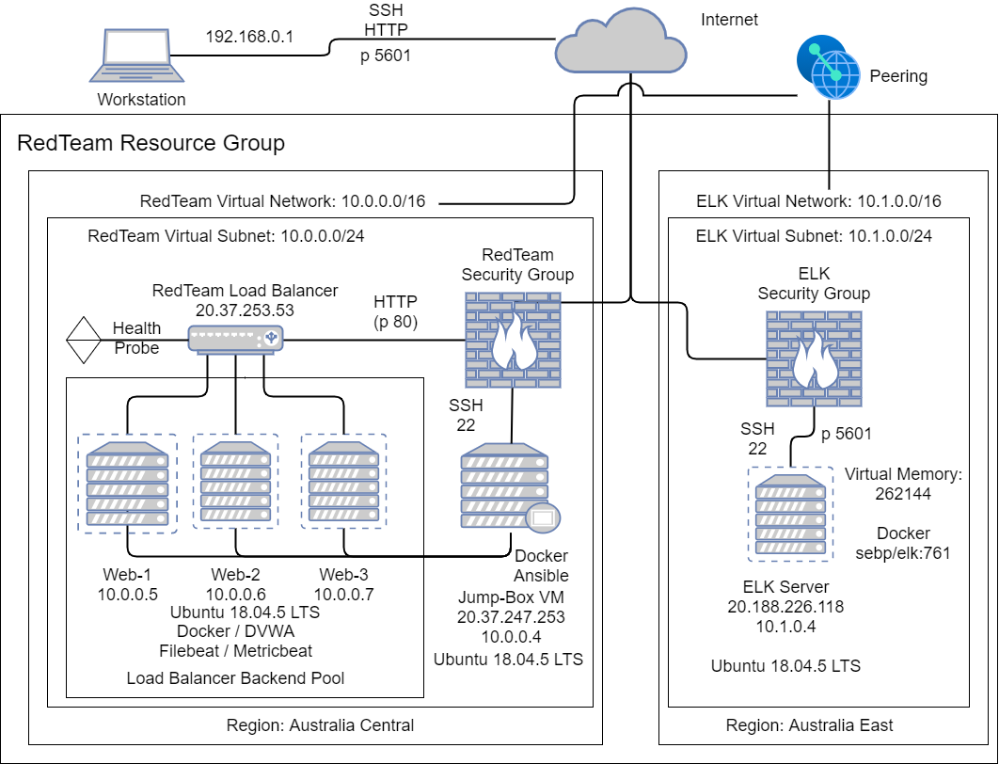

## Automated ELK Stack Deployment

The files in this repository were used to configure the network depicted below.



**Note**: The IP address 192.168.0.1 in the diagram above and mentioned below should be replaced by your personal public IP address.

These files have been tested and used to generate a live ELK deployment on Azure. They can be used to either recreate the entire deployment pictured above. Alternatively, select portions of the playbook file may be used to install only certain pieces of it, such as Filebeat.

  - docker_dvwa-playbook.yml
  - install-elk.yml
  - filebeat-playbook.yml
  - metricbeat-playbook.yml
  - ansible.cfg
  - hosts
  - filebeat-config.yml
  - metricbeat-config.yml


This document contains the following details:
- Description of the Topologu
- Access Policies
- ELK Configuration
  - Beats in Use
  - Machines Being Monitored
- How to Use the Ansible Build

***
### Description of the Topology

The main purpose of this network is to expose a load-balanced and monitored instance of DVWA, the D*mn Vulnerable Web Application.

Load balancing ensures that the application will be highly available, in addition to restricting DoS attacks to the network.
- Load Balancers protect against DDoS attacks. The advantage of a jump box is that you will have only one, highly protected machine, to carry out all your administartion work on other less secure servers.

Integrating an ELK server allows users to easily monitor the vulnerable VMs for changes to the services and system logs.
- Filebeat watches for system log changes.
- Metricbeat records services running on the server.

The configuration details of each machine may be found below.

| Name                 | Function   | Private IP Address | Operating System |
|----------------------|------------|--------------------|------------------|
| Jump-Box-Provisioner | Gateway    | 10.0.0.4           | Linux            |
| Web-1                | Web Server | 10.0.0.5           | Linux            |
| Web-2                | Web Server | 10.0.0.6           | Linux            |
| Web-3                | Web Server | 10.0.0.7           | Linux            |
| ELK-Server           | ELK Server | 10.1.0.4           | Linux            |

***
### Access Policies

The machines on the internal network are not exposed to the public Internet. 

The Jump Box and ELK Serer machines can accept connections from the Internet. Access to these machines is only allowed from the following IP addresses:
- 192.168.0.1

Machines within the network can only be accessed by the personal home machine.
- The personal home machine can access the ELK VM. IP Address: 192.168.0.1

A summary of the access policies in place can be found in the table below.

| Name                 | Publicly Accessible | Allowed IP Addresses |
|----------------------|---------------------|----------------------|
| Jump-Box-Provisioner | Yes                 | 192.168.0.1          |
| Web-1                | No                  | 10.0.0.4             |
| Web-2                | No                  | 10.0.0.4             |
| Web-3                | No                  | 10.0.0.4             |
| ELK-Server           | Yes                 | 192.168.0.1          ||

***
### Elk Configuration

Ansible was used to automate configuration of the ELK machine. No configuration was performed manually, which is advantageous because...
- Any new VM's can be identically setup as the existing VM's.

The playbook implements the following tasks:
- Increase memory on the VM
- Install Docker
- Install Python
- Install ELK with published ports 5044, 5601, and 9200
- Ensure Docker and ELK restart with the VM

The following screenshot displays the result of running `docker ps` after successfully configuring the ELK instance.


***
### Target Machines & Beats
This ELK server is configured to monitor the following machines:
- 10.0.0.5
- 10.0.0.6
- 10.0.0.7

We have installed the following Beats on these machines:
- Filebeats
- Metricbeats

 These Beats allow us to collect the following information from each machine:
- Filebeats collects data about the file system, such as audit logs, server logs, gc logs, deprecation logs and slow logs, and sends the information to Elasticsearch. 

- Metricbeats collects metrics from the system and services running on the server, such as MySql, Nginx, System, Apache etc and sends the data to Elasticsearch.

***
### Using the Playbook
In order to use the playbook, you will need to have an Ansible control node already configured. Assuming you have such a control node provisioned: 

SSH into the control node and follow the steps below:
- Copy the [install-elk.yml](ansible/install-elk.yml) playbook file to `/etc/ansible/` .
- Update the `/etc/ansible/hosts` file to include the elk server host.


- Run the playbook, and navigate to `http://[your.elk.server.public.ip]:5601/app/kibana` to check that the installation worked as expected.

***
### Installing ELK - Specific Commands


- Download the install-elk.yml playbook with the following command from your ansible container:
  ``` bash
  $ curl https://raw.githubusercontent.com/dno-cs/scripts/main/ansible/install-elk.yml > /etc/ansible/install-elk.yml
  ```

 - Edit the hosts file:
    ``` bash
      $ nano /etc/ansible/hosts
    ```
   - Add the following lines to the hosts file:
    ```bash
      [elkservers]
      10.1.0.4 ansible_python_interpreter=/usr/bin/python3 
    ```
 - Run the playbook to install ELK on the ELK server:
    ``` bash
      $ ansible-playbook install-elk.yml
    ```

 - Navigate to the ELK server to confirm ELK is up and running.

***
### Installing Beats - Specific Commands

- Download the filebeat-config.yml and metricbeat-config.yml playbooks to `/etc/ansible/files` with the following command from your ansible container:
  ``` bash
  $ curl https://raw.githubusercontent.com/dno-cs/scripts/main/ansible/filebeat-config.yml > /etc/ansible/files/filebeat-config.yml

  $ curl https://raw.githubusercontent.com/dno-cs/scripts/main/ansible/metricbeat-config.yml > /etc/ansible/files/metricbeat-config.yml
  ```
- Edit the configuration files:

  **NOTE**: Do NOT remove or edit the port numbers. 
  
  Filebeat-config.yml
    ``` bash
      $ nano /etc/ansible/file/filebeat-config.yaml
    ```
   - Edit lines 1105 and 1806 and replace the IP address with the private IP address of your ELK server.:
    ```bash
         hosts: ["10.1.0.4:9200"]     #line 1105
         host: "10.1.0.4:5601"        #line 1806
    ```
  metricbeat-config.yml
    ``` bash
      $ nano /etc/ansible/file/metricbeat-config.yaml
    ```
   - Edit lines 62 and 95 and replace the IP address with the private IP address of your ELK server.:
    ```bash
          host: "10.1.0.4:5601"     #line 62
          host: "10.1.0.4:9200"     #line 95
    ```
- Download the filebeat-playbook.yml and metricbeat-playbook.yml playbooks to `/etc/ansible/` with the following command from your ansible container:
  ``` bash
  $ curl https://raw.githubusercontent.com/dno-cs/scripts/main/ansible/filebeat-playbook.yml > /etc/ansible/filebeat-playbook.yml

  $ curl https://raw.githubusercontent.com/dno-cs/scripts/main/ansible/metricbeat-playbook.yml > /etc/ansible/metricbeat-playbook.yml
  ```
 - Run the playbooks to install beat on the web servers:
    ``` bash
      $ ansible-playbook filebeat-playbook.yml
      $ ansible-playbook metricbeat-playbook.yml    
    ```
 - Navigate to the ELK server to confirm data is being retrieved from the webservers.
